# Sentry

**AI Agentti Ohjaamo · powered by ATOM**

Sentry on käyttäjälle näkyvä pääagentti. ATOM on taustalla oleva agentti- ja työtila-alusta sekä koko projektiperheen tekninen pohja. Tämä repo näyttää projektin käyttäjälle näkyvän suunnan ja tällä hetkellä rakennetun ytimen — ei kaikkia sisäisiä toteutusratkaisuja.

## Sentryn animaatiot ja lasten versio

Sentryn keskushahmo ei ole vain koriste, vaan käyttöliittymän visuaalinen palaute. Animaatio voi reagoida esimerkiksi kuunteluun, puheeseen, ajatteluun, työn etenemiseen, valmistumiseen ja virhetilanteeseen. Ulkoasu/animaatio valitaan käyttäjän toimesta; vaihtoehtoja ei vaihdeta automaattisesti kesken käytön. Ensimmäiseen julkaisuun käytetään hyväksyttyjä still-kuvia, ja 10 valmista animaatiota säilytetään erillisinä vaihtoehtoina myöhempää käyttöliittymäpäivitystä varten.

### Lasten Sentry

Lasten versio on oma käyttökokemuksensa, ei vain aikuisten näkymä eri väreillä. Sen keskellä on ystävällinen virtuaalinen hahmo/kumppani ja käyttöliittymä on selkeämpi, rauhallisempi ja helpommin lähestyttävä. Lapsi voi valita hahmon tai ulkoasun itse.

Tavoitteena on digitaalinen kaveri, joka tukee lapsen kasvua myös koulun ulkopuolella. Sentry voi auttaa harjoittelemaan esimerkiksi rahankäyttöä, ajankäyttöä, järkevää netti- ja peliaikaa, arjen valintoja, tiedonhakua ja ongelmanratkaisua.

Keskeinen periaate on **auta tekemään — älä tee lapsen puolesta**. Sentry ei anna vain valmista ratkaisua silloin, kun lapsi pystyy etenemään itse, vaan pilkkoo asian sopiviin vaiheisiin, kysyy, antaa vihjeitä ja auttaa lasta tarkistamaan oman ratkaisunsa. Tavoitteena on, että lapsen oma harkinta, taidot ja itsenäisyys kehittyvät käytön mukana.

Tätä varten lasten versiossa on tarkoituksellinen oppimisen "jarru": avun tasoa voidaan rajata tilanteen, iän ja tehtävän mukaan. Sentry voi ensin kysyä lapsen omaa ajatusta, tarjota seuraavan vihjeen vasta tarvittaessa ja siirtyä suorempaan apuun vasta, kun se on perusteltua. Jarrun tarkoitus ei ole estää avun saamista vaan estää sitä, että tekoäly korvaa harjoittelun ja oman ajattelun.

Huoltajan asetukset, ikätasoinen sisältö, yksityisyys ja turvallisuus muodostavat erilliset rajat. Lasten versio ei saa tehdä itsenäisesti korkean vaikutuksen toimia lapsen puolesta. Tämä "lapsi kehittyy, Sentry tukee" -periaate on myös keskeinen osa tuotteen esittelyä.

## Viimeisin kehityspäivitys — työn alla

Nykyinen varmennettu kehityslinja sisältää:
- jatkuvan agenttisilmukan ja taustatyön
- prioriteetti- ja resurssienhallinnan
- tavoitegraafin, riippuvuudet, blocker-tilat ja etenemisen
- selain- ja tutkimustyökalujen orkestroinnin
- muistia ja hallittua oppimista
- PWA-käyttöliittymän
- provider/model-routingin pohjan
- lokituksen ja turvallisen hyväksyntämallin jatkokehityksen

Kehitys jatkuu. Julkinen README ei ole täydellinen tekninen inventaario eikä lupaus siitä, että kaikki suunnitellut ominaisuudet ovat jo tuotannossa.

## Sentry-ohjaamo

Sentryn käyttöliittymän tavoite ei ole tavallinen korttidashboard. Ohjaamo rakentuu selkeistä painikkeista, jatkuvasta tilapalautteesta ja agentin sekä käyttäjän välisestä vuorovaikutuksesta.

Käyttäjä näkee työn elinkaaren esimerkiksi:

**Kuuntelen → Suunnittelen → Haen tietoa → Analysoin → Kokoan → Valmis**

Sentry-ohjaamo yhdistää keskustelun, aktiivisen tehtävän, projektit, työkalut, selaimen, tiedostot, muistin ja tulokset samaan näkymään. Tarkoitus on, että käyttäjä näkee mitä ATOM tekee ilman että sisäinen toteutus paljastetaan.

### Näkymävalinta

Aikuisten ja lasten näkymät ovat käyttäjän itse valittavia. Aikuisten Sentry käyttää hillittyjä teknisiä teemoja; lasten Sentry toimii ystävällisempänä virtuaalisena kumppanina, joka neuvoo, auttaa, muistuttaa sovituista asioista ja kasvaa käyttökokemuksen mukana. Animaatiot ja teemat pidetään erillisinä vaihtoehtoina eikä niitä kierrätetä automaattisesti.

### Käyttöliittymäkuvat

Alla olevat kuvat ovat projektin nykyisiä oikeita konsepti-/käyttöliittymäkuvia. Ne pidetään alkuperäisinä assetteina eikä korvata geneerisillä placeholder-kuvilla.

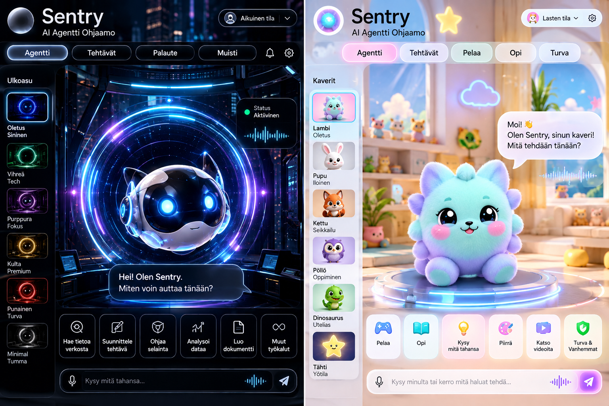

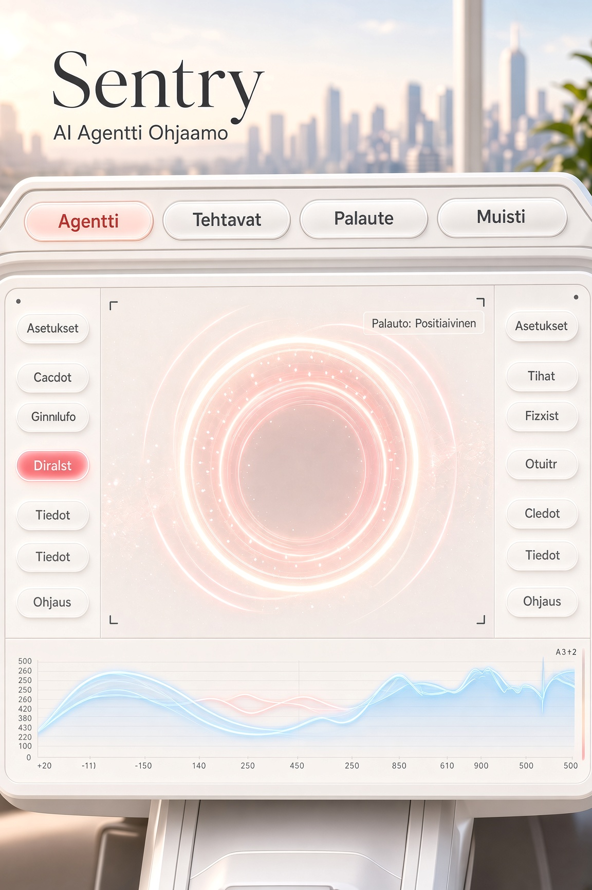

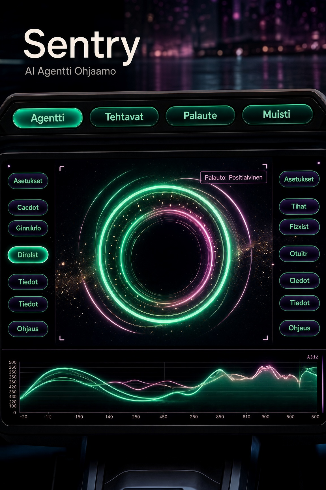

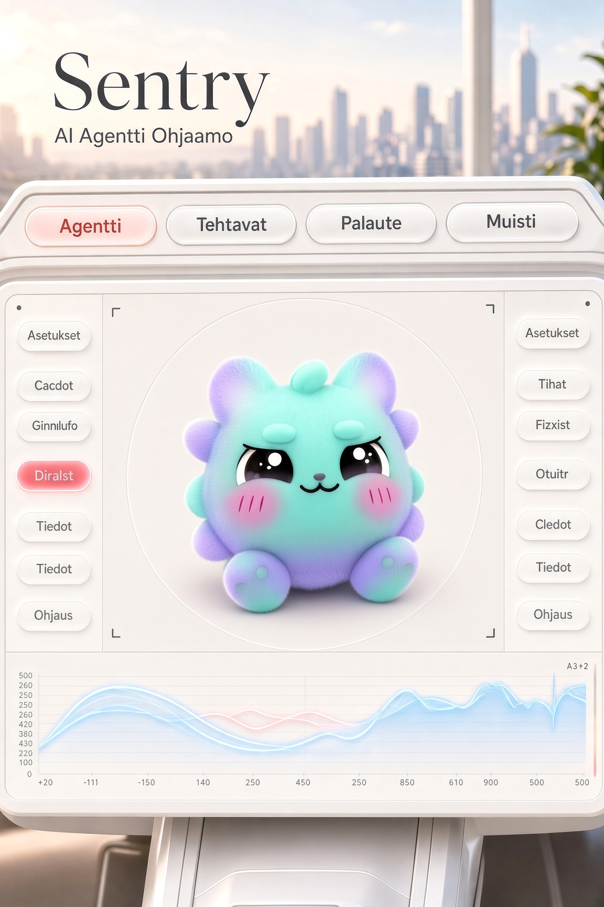

### Teini-ikäisten käyttöliittymäkuvat

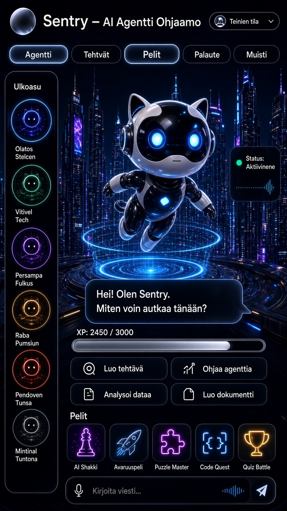

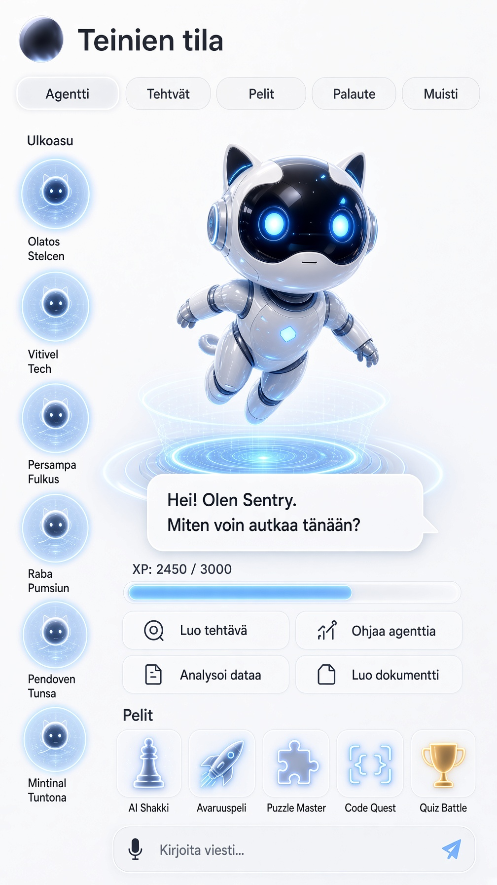

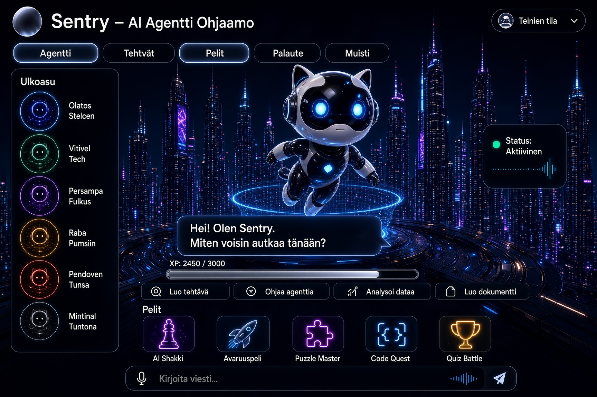

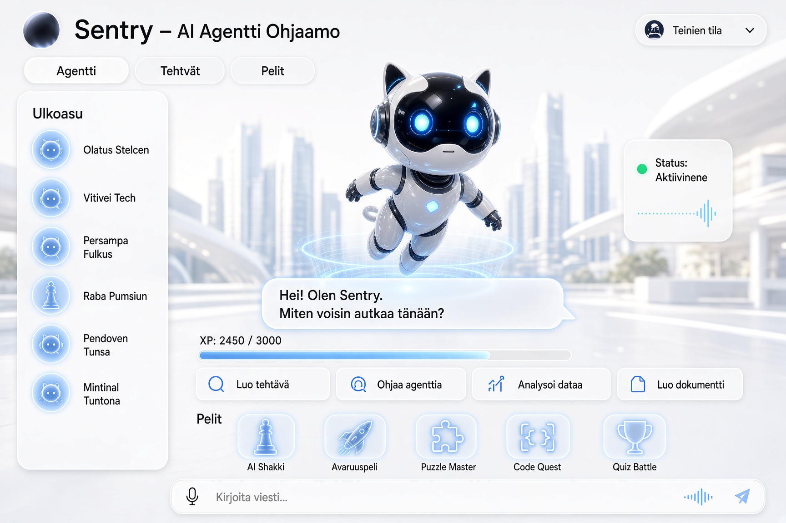

### Lasten käyttöliittymäkuvat

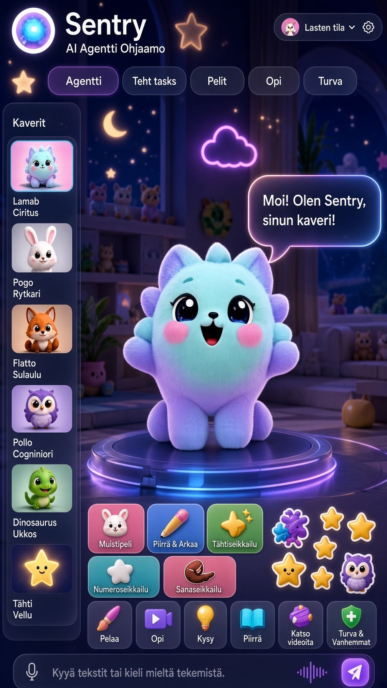

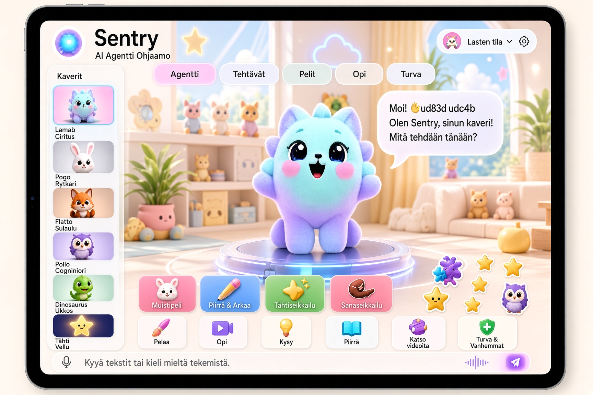

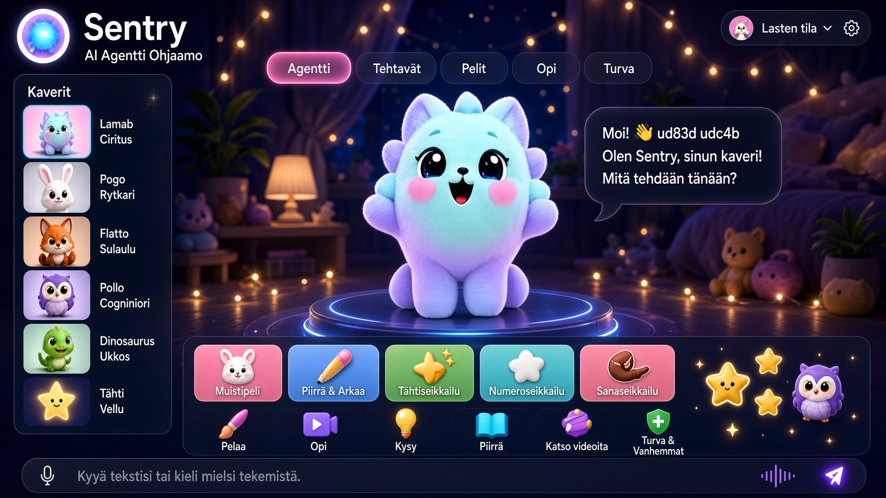

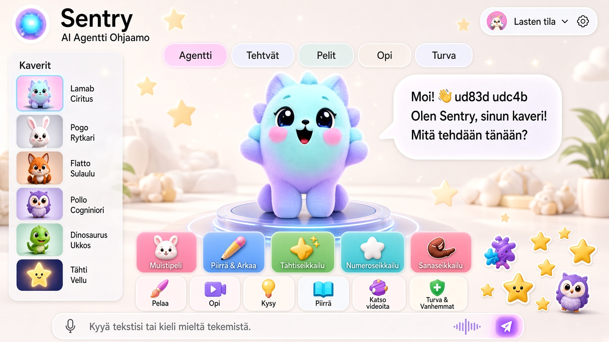

### Visuaalisen käyttöliittymän jatkolinja

**Aikuisten versio:** nykyinen ympyrämäinen keskuselementti ei ole lopullinen tunnus. Jatkokehityksessä tutkitaan omaleimaisempaa, teknistä ja elävää Sentry-elementtiä, joka näyttää kuuntelun, ajattelun, työskentelyn ja valmistumisen ilman että käyttöliittymä rakentuu yhden tavallisen AI-pallon ympärille.

**Lasten versio:** lasten käyttöliittymä säilytetään selvästi erillisenä aikuisten ohjaamosta. Nykyisen hyväksytyn lasten näkymän suunta toimii pohjana. Seuraavissa vaiheissa rakennetaan Sentrylle omat alkuperäiset hahmot, ei valmiiden hahmomaailmojen kopioita.

Hahmo ja käyttöliittymä voivat kehittyä lapsen ikätason mukana: pienemmälle käyttäjälle visuaalisempi ja hahmovetoisempi kokemus, myöhemmin asteittain itsenäisempi ja teknisempi näkymä. Ikä ei yksin vaihda kokemusta äkillisesti, vaan siirtymät suunnitellaan hallituiksi ja huoltajan asetukset huomioiviksi. Lapsen oma eteneminen, taidot ja valinnat voivat avata uusia käyttöliittymän tasoja ilman että järjestelmä tekee asioita lapsen puolesta.

> Hyväksytyt media-assettit säilytetään alkuperäistiedostoina ja käyttöliittymäkuvia päivitetään projektin edetessä.

## Periaate

ATOM automatisoi rutiinia ja palautettavia työvaiheita. Ulkoiset, peruuttamattomat tai merkittävät toimet kuuluvat hyväksyntärajan taakse.

## Julkinen vs. sisäinen

Julkisesti voidaan näyttää käyttökokemus, työn eteneminen ja tuotteen yleiset kyvykkyydet. Tunnukset, avaimet, selainistunnot, asiakasdata, sisäinen deploy-rakenne ja kilpailuetua tuovat keskeneräiset yksityiskohdat eivät kuulu julkiseen repoon.
